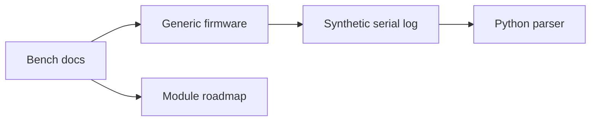

# ESP32 IoT Integration Lab

Independent public portfolio project for **ESP32**, **IoT integration**, **embedded documentation** and **Python log validation**.

This repository was created from scratch with generic firmware examples and synthetic logs. It does not contain corporate code, real data, private endpoints, credentials, logs or proprietary rules.

## Problem

IoT labs need a clear way to evolve UART, RFID, CAN, GNSS, Cellular and MQTT experiments without mixing unrelated examples or depending on private hardware context.

## What It Demonstrates

- Generic ESP32 firmware foundation.
- Modular lab structure for UART, RFID, CAN, GNSS, Cellular and future MQTT work.
- Public bench documentation and generic pinout.
- Synthetic serial logs.
- Python parser for module readiness signals.
- Focused tests for parser and manifest behavior.

## Architecture



See [docs/architecture.md](docs/architecture.md), [docs/bench-lab.md](docs/bench-lab.md) and [docs/generic-pinout.md](docs/generic-pinout.md).

## Stack

`ESP32` `Arduino` `Python` `Serial logs` `Synthetic data` `Mermaid`

## Run Locally

```powershell
python -m pip install -e .
python examples/run_demo.py
```

## Run Tests

```powershell
python -m pip install -e ".[dev]"
pytest
```

## Technical Decisions

- MQTT is documented as future work instead of being added prematurely.
- Hardware notes are generic and based on public bench concepts.
- Synthetic logs are used so the project remains demonstrable without private devices.

## Roadmap

- Add one module at a time with public references and synthetic logs.
- Add MQTT after the next study phase.
- Add bench photos or screenshots only if they contain no private information.

## Security and Independence

See [SECURITY.md](SECURITY.md) and [DISCLAIMER.md](DISCLAIMER.md).
