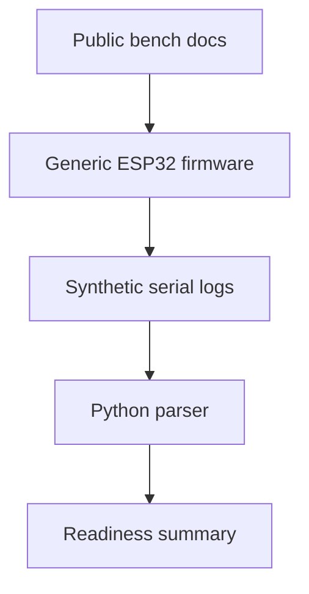

# Architecture

## Design Goal

Organize a public ESP32 integration lab that can evolve module by module without copying private hardware designs or real operational data.

## Structure

## Module Boundaries

UART is the active validation path in v0.2.0. RFID, CAN and Cellular are documented with generic examples. GNSS remains planned. MQTT is explicitly left for a future study phase.
