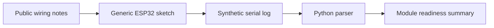

# Bench Lab Structure

## Modules

- UART: active synthetic log parsing.
- RFID: documented with generic demo tag examples.
- CAN: documented as a future bench flow with synthetic frames.
- GNSS: planned; placeholders only.
- Cellular: documented as a generic modem readiness flow.
- MQTT: future study topic, not implemented in v0.2.0.

## Flow

## Bench Instructions

1. Flash only generic firmware examples from this repository.
2. Capture serial output from synthetic or public hardware examples.
3. Store only sanitized, synthetic logs in `data/sample/`.
4. Update the manifest when a module moves from planned to documented or active.
